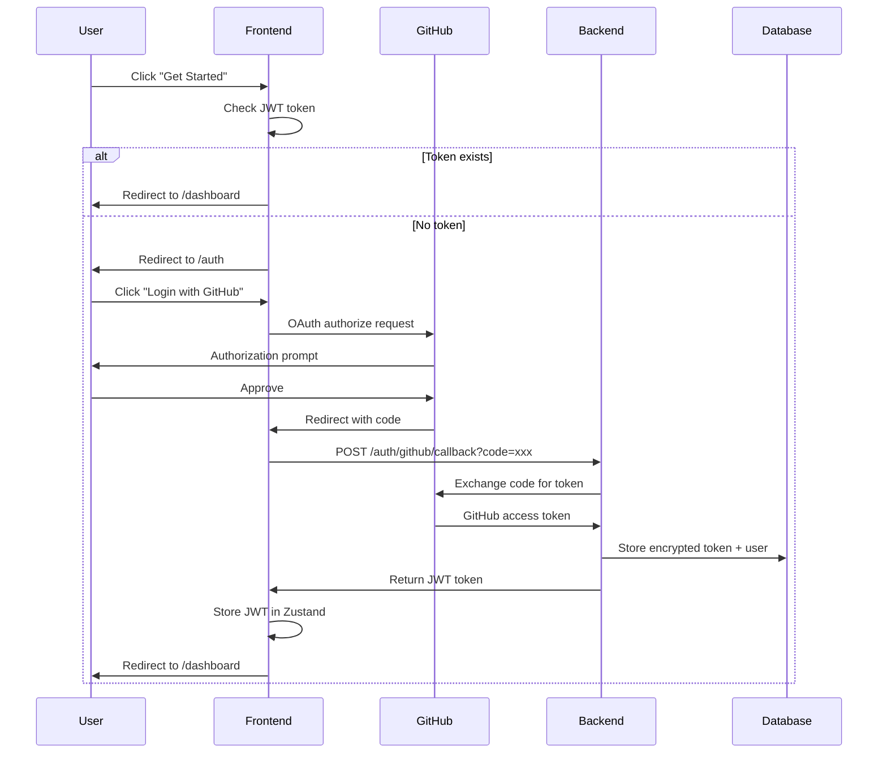

# DevPath AI Frontend

> AI-powered developer career analytics platform with stateful authentication, persistent reports, and intelligent career insights.

**Built with Next.js 15 · TypeScript · Tailwind CSS · Framer Motion**

---

## Overview

DevPath AI analyzes your GitHub profile to provide personalized career insights, skill assessments, and growth recommendations. The platform features a refined black and white aesthetic with seamless authentication, persistent report storage, and intelligent caching.

### Key Features

- **GitHub OAuth Authentication** - Secure, token-based login with persistent sessions
- **Automatic Report Loading** - Latest analysis loads on dashboard mount (no re-analysis needed)
- **Report History Management** - View, load, and delete up to 3 saved analyses
- **Smart Landing Page** - Auto-redirects authenticated users to dashboard
- **Real-time Analysis Dates** - See when each analysis was performed
- **GitHub Profile Display** - Username shown in navbar when logged in
- **Responsive Design** - Mobile-first UI that works on all devices

---

## Core Modules

### 1. GitHub Profile Analysis

**Comprehensive repository analysis powered by Gemini AI**

- **Developer Archetype Detection** - Builder, Refiner, or Maintainer
- **Skill Constellation** - Auto-extracted from 60+ recognized technologies
- **Flagship Projects** - Top 1-3 projects identified by AI
- **Code Quality Analysis** - AI-powered review of selected code samples
- **Career Path Suggestions** - 3 personalized career paths with skills to develop
- **Project Ideas** - 3 AI-generated project recommendations

**Processing:** 30-60 seconds · **Rate Limit:** 5 per hour

### 2. Career Track Generator

**Personalized learning roadmap from current skills to target domain**

- **Input:** Current skills + Target domain (e.g., "Machine Learning")
- **Output:** 3-step learning path
  1. **Learning Step** - Foundational knowledge to acquire
  2. **Bridge Project** - Intermediate project to apply concepts
  3. **Capstone Project** - Advanced project demonstrating mastery
- **Includes:** Tech stack recommendations and feature breakdowns

**Rate Limit:** 10 per hour

### 3. Market Match Analysis

**Gap analysis comparing your skills to job requirements**

- **20 Pre-configured Job Roles:**
  - Data Engineer, ML Engineer, Senior React Developer
  - Senior Python Backend Developer, DevOps Engineer
  - Generative AI Specialist, Cloud Solutions Architect
  - Security Engineer, Mobile App Developer
  - AI Product Engineer, Data Scientist
  - Full Stack Engineer, Site Reliability Engineer (SRE)
  - AI Infrastructure Engineer, Data Platform Engineer
  - Blockchain Developer, Computer Vision Engineer
  - AI Prompt Engineer, Automation Engineer
  - Embedded Systems Engineer

**Output:** Matching skills, missing skills, and AI-generated summary

**Rate Limit:** 20 per hour

---

## Tech Stack

| Category          | Technology                              |
| ----------------- | --------------------------------------- |
| **Framework**     | Next.js 15.5.6 (App Router)             |
| **Language**      | TypeScript (strict mode)                |
| **Styling**       | Tailwind CSS 3.x                        |
| **Animations**    | Framer Motion 11.x                      |
| **State**         | Zustand (with persist middleware)       |
| **HTTP Client**   | Custom fetch wrapper with JWT injection |
| **Icons**         | Lucide React                            |
| **Notifications** | React Hot Toast                         |
| **Backend**       | FastAPI (Python) - v3.0.0               |

---

## Quick Start

### Prerequisites

- **Node.js** 18+ (with npm)
- **DevPath AI Backend** running at `http://localhost:8000`
- **GitHub OAuth App** configured (client ID required)

### Installation

```powershell
# Clone repository
git clone https://github.com/ANIMANxd/devpath-ai-frontend.git
cd devpath-ai-frontend

# Install dependencies
npm install

# Create environment file
cp .env.local.example .env.local
```

### Environment Variables

Create `.env.local` in project root:

```env
NEXT_PUBLIC_API_BASE=http://localhost:8000
NEXT_PUBLIC_GITHUB_CLIENT_ID=your_github_client_id_here
```

**Getting GitHub Client ID:**

1. Go to GitHub → Settings → Developer settings → OAuth Apps
2. Create new OAuth App
3. Set Authorization callback URL: `http://localhost:3000/auth`
4. Copy Client ID

### Run Development Server

```powershell
npm run dev
```

Open [http://localhost:3000](http://localhost:3000)

### Build for Production

```powershell
npm run build
npm start
```

---

## Usage Guide

### First-Time Login

1. **Click "Get Started"** on landing page
2. **Authorize with GitHub OAuth** (redirects to GitHub)
3. **Return to dashboard** - JWT token stored automatically
4. **No saved reports** - Click "Start Full Analysis"
5. **Wait 30-60 seconds** - AI analyzes your GitHub profile
6. **Report auto-saved** - Now available in History tab

### Returning User Experience

1. **Click "Get Started"** on landing page
2. **Auto-redirect to dashboard** - Already authenticated (JWT persisted)
3. **Latest report auto-loads** - No re-analysis needed
4. **See analysis date** - Shows when report was created
5. **Optional: Re-analyze** - Click "Re-analyze" button for fresh data

### Managing Report History

**View History:**

- Go to **History** tab in dashboard
- See up to 3 most recent analyses
- Each shows: Report ID, creation date, current status

**Load Past Report:**

- Click **Load** button on any report
- Report opens in Analysis tab
- Date updates to show report age

**Delete Report:**

- Click **Delete** button (with confirmation)
- Report removed from history
- If current report deleted, clears dashboard

**Re-analyze:**

- Click **Re-analyze** button in Analysis tab
- New report generated and auto-saved
- Old reports remain accessible in history

### Generating Career Track

1. Navigate to **Career Track** tab
2. Select current skills (multi-select)
3. Enter target domain (e.g., "Frontend with React")
4. Click **Generate Career Track**
5. Review 3-step roadmap:
   - Learning Step
   - Bridge Project
   - Capstone Project

### Market Match Analysis

1. Navigate to **Market Match** tab
2. Select your skills (multi-select)
3. Choose target job title (dropdown with 20 roles)
4. Click **Analyze Market Fit**
5. View results:
   - Matching skills (green badges)
   - Missing skills (red badges)
   - AI-generated summary

---

## Project Structure

```
devpath-ai-frontend/
├── src/
│   ├── app/                          # Next.js 15 App Router
│   │   ├── page.tsx                  # Landing page (smart CTA routing)
│   │   ├── layout.tsx                # Root layout with Toaster
│   │   ├── globals.css               # Global styles + utilities
│   │   ├── auth/
│   │   │   └── page.tsx             # OAuth callback handler
│   │   ├── dashboard/
│   │   │   └── page.tsx             # Main dashboard (4 tabs)
│   │   └── explore/
│   │       └── page.tsx             # Features showcase
│   ├── components/
│   │   └── dashboard/
│   │       ├── AnalysisSection.tsx   # GitHub profile analysis
│   │       ├── CareerTrackSection.tsx # Learning roadmap generator
│   │       └── MarketMatchSection.tsx # Job skills gap analysis
│   ├── lib/
│   │   ├── api.ts                    # API client with JWT injection
│   │   └── utils.ts                  # cn() utility for Tailwind
│   ├── store/
│   │   └── auth.ts                   # Zustand store (JWT + username)
│   └── types/
│       └── api.ts                    # TypeScript interfaces (v3.0.0)
├── public/                           # Static assets
├── api_documentation.md              # Backend API reference
├── package.json
├── tsconfig.json
├── tailwind.config.ts
├── next.config.mjs
├── postcss.config.mjs
└── README.md
```

---

## Authentication Flow



---

## API Integration

### Endpoints Used

| Endpoint                | Method | Auth | Purpose                       |
| ----------------------- | ------ | ---- | ----------------------------- |
| `/auth/github/callback` | GET    | No   | Exchange OAuth code for JWT   |
| `/analyze`              | POST   | Yes  | Full GitHub profile analysis  |
| `/generate-track`       | POST   | Yes  | Generate career roadmap       |
| `/market-match`         | POST   | Yes  | Job skills gap analysis       |
| `/reports/`             | GET    | Yes  | List analysis history (max 3) |
| `/reports/{id}`         | GET    | Yes  | Retrieve specific report      |
| `/reports/{id}`         | DELETE | Yes  | Delete report                 |

### Rate Limits

- **Analysis**: 5 per hour per user
- **Career Track**: 10 per hour per user
- **Market Match**: 20 per hour per user

### Error Handling

| Status | Meaning      | Frontend Action                             |
| ------ | ------------ | ------------------------------------------- |
| 200    | Success      | Display result                              |
| 204    | No Content   | Return undefined (delete success)           |
| 401    | Unauthorized | Clear JWT, redirect to /auth                |
| 404    | Not Found    | Show "No repos found" or "Report not found" |
| 429    | Rate Limited | Show "Try again in X minutes"               |
| 500    | Server Error | Show "Something went wrong"                 |

---

## Customization

### Design System

**Colors** (edit `src/app/globals.css`):

```css
/* Current: Black & White with opacity */
border-white/20  /* Subtle borders */
bg-white/5       /* Light backgrounds */
text-white/60    /* Muted text */
```

**Animations** (edit `tailwind.config.ts`):

```typescript
animation: {
  'pulse-slow': 'pulse 3s cubic-bezier(0.4, 0, 0.6, 1) infinite',
}
```

**Typography**:

- Primary: System font stack
- Monospace: `mono` class (SF Mono, Consolas, etc.)

### Backend URL

Update `.env.local`:

```env
NEXT_PUBLIC_API_BASE=https://your-api-domain.com
```

---

## Troubleshooting

### Issue: "Please authenticate first" on dashboard

**Cause:** JWT token expired or cleared  
**Solution:**

1. Check localStorage: `localStorage.getItem('devpath-auth')`
2. If null, re-login via OAuth
3. JWT tokens expire after 7 days

### Issue: Username not showing in navbar

**Cause:** No analysis reports yet  
**Solution:**

1. Run your first analysis
2. Username extracted from repo names (format: `username/repo-name`)
3. Should appear after first successful analysis

### Issue: "Failed to load report history"

**Cause:** Backend not running or network error  
**Solution:**

```powershell
# Test backend connection
curl http://localhost:8000/health
```

Expected response:

```json
{
  "status": "healthy",
  "version": "3.0.0"
}
```

### Issue: OAuth callback fails

**Cause:** GitHub Client ID misconfigured  
**Solution:**

1. Verify `NEXT_PUBLIC_GITHUB_CLIENT_ID` in `.env.local`
2. Check OAuth app callback URL: `http://localhost:3000/auth`
3. Ensure backend has correct GitHub client secret

### Issue: CORS errors

**Cause:** Backend not allowing frontend origin  
**Solution:**
Backend should allow: `http://localhost:3000`

Set in backend `.env`:

```env
ALLOWED_ORIGINS=http://localhost:3000,https://your-domain.com
```

---

## Deployment

### Vercel (Recommended)

1. **Push to GitHub:**

   ```powershell
   git add .
   git commit -m "feat: production ready"
   git push origin main
   ```

2. **Import to Vercel:**

   - Go to [vercel.com](https://vercel.com)
   - Click "Import Project"
   - Select your GitHub repository

3. **Configure Environment Variables:**

   ```
   NEXT_PUBLIC_API_BASE=https://your-backend-url.com
   NEXT_PUBLIC_GITHUB_CLIENT_ID=your_github_client_id
   ```

4. **Deploy:**

   - Vercel auto-deploys on every push to `main`
   - Production URL: `https://your-app.vercel.app`

5. **Update GitHub OAuth:**
   - Add production callback: `https://your-app.vercel.app/auth`

### Manual Deployment

```powershell
# Build
npm run build

# Test production build locally
npm start

# Deploy build folder (.next/) to your hosting
```

---

## Development Scripts

```powershell
npm run dev          # Start dev server (http://localhost:3000)
npm run build        # Production build
npm start            # Start production server
npm run lint         # Run ESLint
```

---

## Backend Requirements

**DevPath AI Backend v3.0.0 or higher**

Required backend features:

- JWT-based authentication
- Report persistence (PostgreSQL/SQLite)
- GitHub token encryption
- Report history endpoint (GET /reports/)
- Report management (GET/DELETE /reports/{id})

See `api_documentation.md` for complete backend API reference.

---

## Contributing

This project is actively maintained. To contribute:

1. **Fork repository**
2. **Create feature branch:** `git checkout -b feature/your-feature`
3. **Make changes** and test thoroughly
4. **Commit:** `git commit -m "feat: add your feature"`
5. **Push:** `git push origin feature/your-feature`
6. **Open Pull Request** with detailed description

### Code Style

- **TypeScript:** Strict mode enabled
- **Formatting:** Prettier (auto-format on save)
- **Linting:** ESLint with Next.js rules
- **Components:** Functional components with hooks
- **State:** Zustand for global, useState for local

---

## License

**Proprietary** - DevPath AI © 2025

All rights reserved. This software is provided for use with DevPath AI services only.

---

## Credits & Technologies

Built with:

- [Next.js](https://nextjs.org/) - React framework
- [TypeScript](https://www.typescriptlang.org/) - Type safety
- [Tailwind CSS](https://tailwindcss.com/) - Utility-first CSS
- [Framer Motion](https://www.framer.com/motion/) - Animations
- [Zustand](https://github.com/pmndrs/zustand) - State management
- [Lucide](https://lucide.dev/) - Icon library
- [React Hot Toast](https://react-hot-toast.com/) - Notifications

---

## Support

**Documentation:** `api_documentation.md`  
**Backend Repo:** [devpath-ai-backend](https://github.com/ANIMANxd/devpath-ai-backend)  
**Issues:** [GitHub Issues](https://github.com/ANIMANxd/devpath-ai-frontend/issues)

---

**Built for developers, by developers.** 🚀
